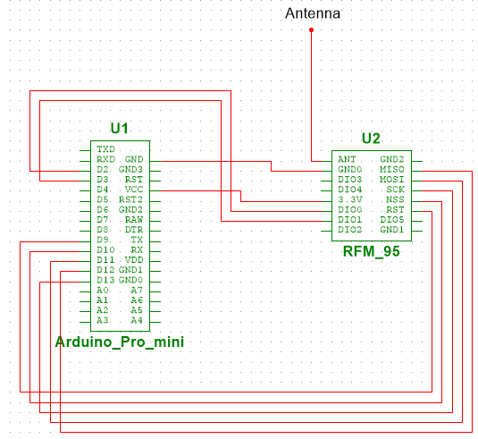
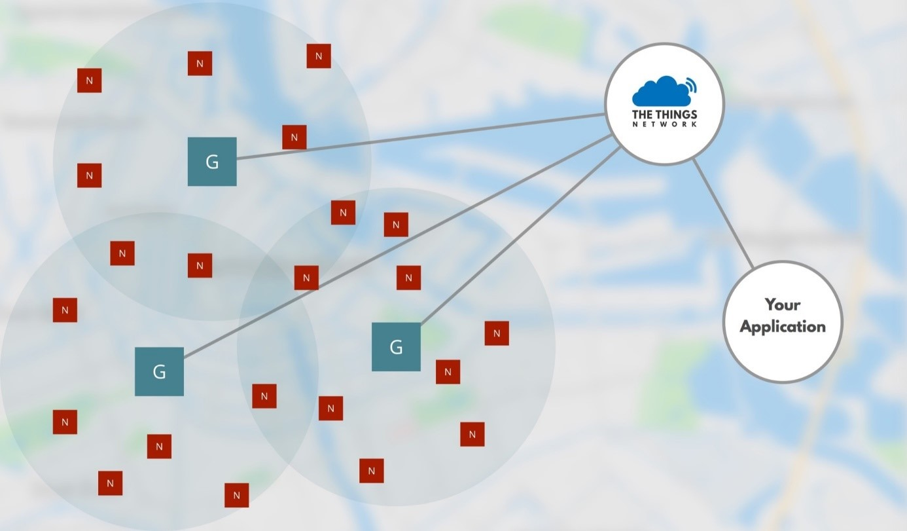
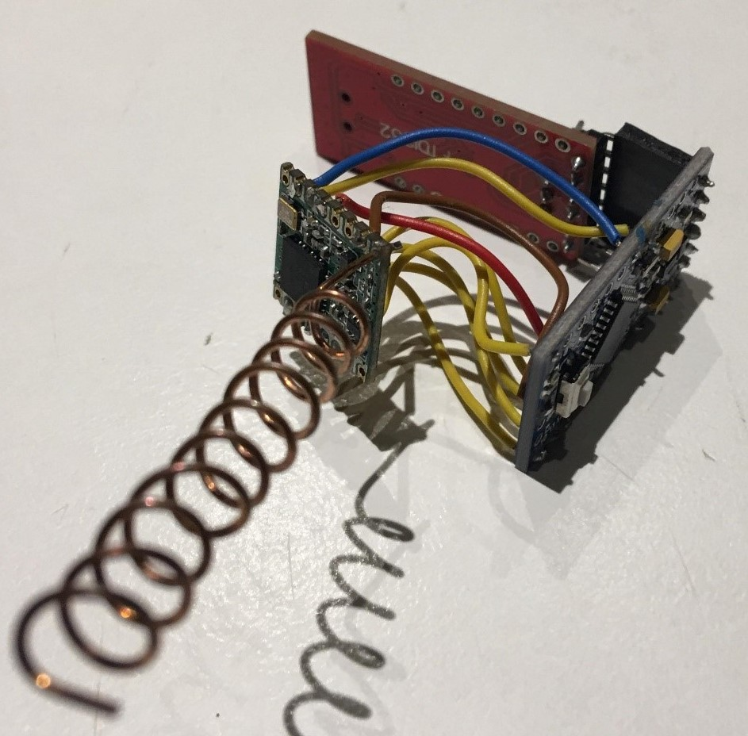
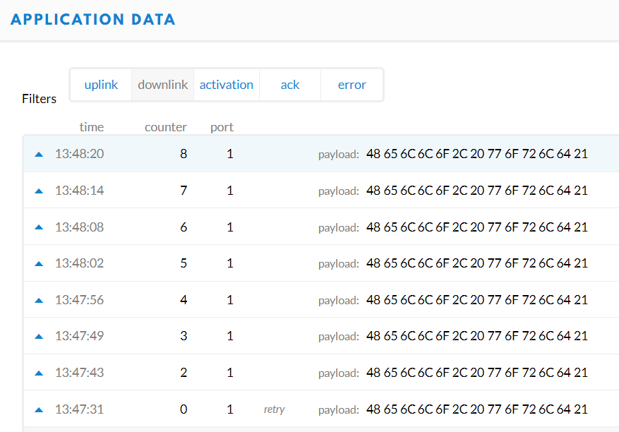
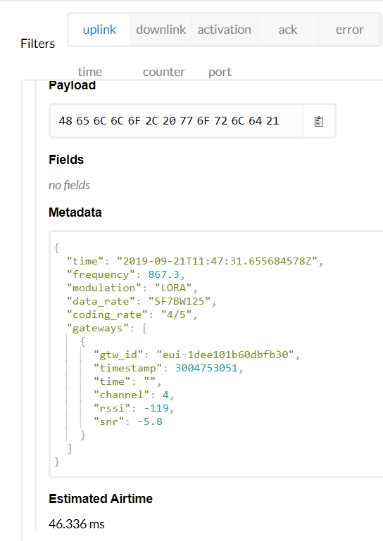
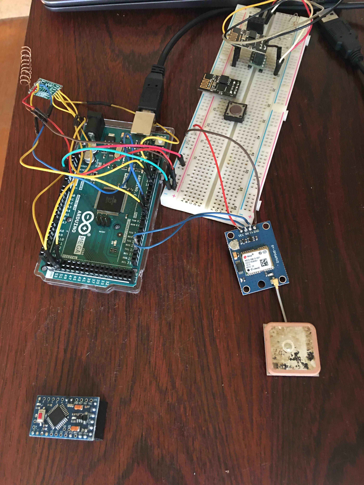
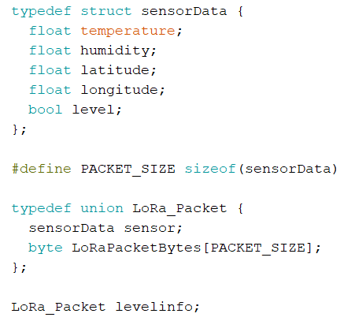
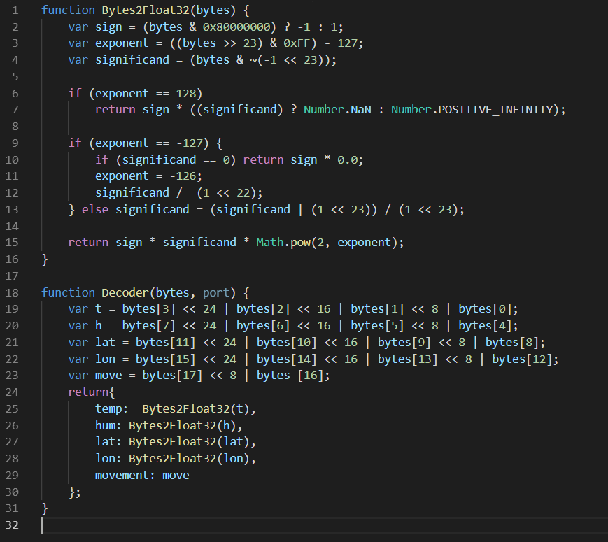
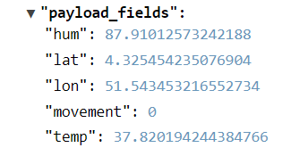
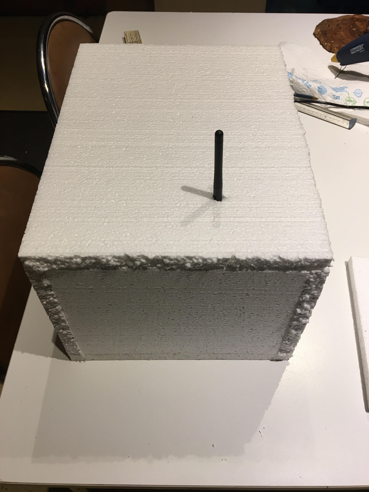

# Analyse

## Functionale analyse project 

### Beschrijving
Tijdens het transport van medicijnen in Afrika kan er veel mislopen door het klimaat en de lokale infrastructuur.  
We denken dan aan oververhitting, te veel beweging tot zelfs medicijnen in hun fiool ondersteboven staan.  
Deze problemen worden meestal pas opgemerkt in het ziekenhuis of soms zelfs te laat.  
Met deze oplossing hopen wij dit probleem te verhelpen door gebruik te maken van nieuwere technieken.  
Door periodieke metingen uit te voeren in de doos tijdens het transport gaan we gemakkelijker kunnen zien of er een probleem ontstaat en kan er vrij snel een nieuwe levering gemaakt worden.  
Medicijnen gaan in een zogenaamde 'SmartBox' waar de metingen plaatsvinden.  
Met periodieke intervallen gaan we metingen doen op:  
* Temperatuur  
* Vochtigheid
* Beweging  
* Oriëntatie
* Licht  

Tijdens het transport worden deze via het LoRa netwerk naar een veilige database gestuurd inclusief de locatie.  
Op een mobiele applicatie gaan dokters hun pakketje kunnen opvolgen.  
Hierop gaan ze een lijst krijgen met alle pakketjes, hun status en de afstand.   
Ook de gemeten data is hierop gemakkelijk zichtbaar.  
Als er een te hoge of lage meting is van de data gaan ze ook een melding krijgen op hun telefoon.  
Met deze notificatie komen ze op een scherm waar alle data van het pakketje zichtbaar is (Sensoren, GPS-Locatie, Uur van vertrek).  
Via een knop kunnen ze zien wat exact het probleem is en gaan ze een keuze moeten maken:  
* Waarde is oke
* Opnieuw bestellen
* Annuleren  

De leverancier zal op de hoogte gebracht worden van de keuze die gemaakt werd door de dokters.  
Zo kan hij/zij beslissen om terug te draaien en een nieuwe bestelling te proberen.  
### Kenmerken
#### SmartBox
De SmartBox heeft de volgende sensoren en andere nodige hardware:
* Temperatuur sensor: Meten van de temperatuur binnen de doos.   
* Vochtigheids sensor: Meten van de vochtigheid binnen de doos.  
* Schok sensor: Meten wanneer er een schok plaatsvind.  
* Orientatie sensor: Meten of de orientate binnen de normen is.  
* GPS Tracker: Locatie traceren van de doos.  
* LoRa module: Mogelijkheid geven om data te versturen via LoRa.  
* Bluetooth module: Mogelijkheid tot instellen van de doos.  
#### LoRa WAN
LoRa-modulatietechnologie wordt gebruikt om de waarden die we van de sensoren hebben ontvangen om het internet te bereiken. (en uiteindelijk de app) Dit wordt gedaan door een radiosignaal van het knooppunt dat we hebben gemaakt, naar de gateway van The Things Network te sturen. LoRa staat voor Long Range, wat optimaal is voor dit project omdat er niet zoveel GPRS-stations in Afrika zijn.
#### Things Network
The Things Network is de eerste instantie die onze verzonden waarden ontvangt. The Things Network heeft een eenvoudige HTTP-integratie. We hebben deze integratie gebruikt om de gegevens naar een API-eindpunt te verzenden. Deze gateway vertaalt het radiosignaal in de gegevens die via internet naar de toepassing moeten worden verzonden.
#### Microsoft Azure
Met behulp van Microsoft Azure kunnen de database en de Web API worden gehost voor goedkope kosten met behulp van cloud computing.
Microsoft Azure biedt ook servers in Noord- en Zuid-Afrika voor verbindingen met lage latentie.
#### Bidirectionele efficiënte communicatie
Hiermee kunnen realtime gegevens voor duizenden smartphones worden opgehaald, maar ook gegevens naar de database worden verzonden met een extreem lage latentie. Perfect voor snelle expansie op het Afrikaanse continent.
#### Android smartphones
Op de applicaties kunnen we de ziekenhuizen, leveringen, medicijnen en de leveranciers beheren en / of bekijken.
Bepaalde functies zijn beperkt tot voor sommige applicaties om de verantwoordelijkheden te verdelen.
Met behulp van Textviews, Listviews, grafieken en geïntegreerde google maps, kunnen de ontvangen gegevens op een professionele manier worden bekeken op mobiele apparaten.
#### Wear OS
Als u een Wear OS-compatibele apparaat in verbinding met uw smartphone heeft, kunt u ook waarschuwingen op het apparaat ontvangen en bekijken.
#### Swagger
Onze web API-eindpunten zijn goed gedocumenteerd met behulp van de Swagger-extensie.  
Swagger biedt:  
* geautomatiseerde documentatie   
* codegeneratie  
* testcasegeneratie.  
### Marktonderzoek 
X: Aanwezig  
-: Niet aanwezig 

Product | **H.Essers** | **Particle** | **Tempmate** | **Bosch** | **Aspion**
------------ |  ------------- | ------------- | ------------- | ------------- | ------------- 
 **Type** | Gekoelde lorry  | Assets | Datalogger | Transport Logger | G-Log
 **Temperatuur** | X  | X | X | X | X
 **Vochtigheid** | -  | X | X | X | -
 **Beweging** | -  | X | X | X | X
 **Oriëntatie** | -  | X | - | X | X
 **Belichting** | -  | - | X | - | -
 **GPS** | X  | X | - | - | -
 **Applicatie** | Website  | App, Website | Website | App | App
 **Realtime Tracking** | X  | X | X | - | -
 **Website** | [H. Essers](https://www.essers.com/en/segments/pharma-healthcare/pharma/temperature-controlled-transport-and-real-time-monitoring/ "H. Essers Temperature Controller Transport")  | [Asset Tracker](https://store.particle.io/products/asset-tracker "Asset Tracker Shop Page") | [GS Datalogger](https://www.dataloggers.shop/GS_Transport_Datalogger?Lng=en "GS Datalogger's Website")  | [Bosch](https://www.bosch-connectivity.com/products/connected-logistics/transport-data-logger/ "Bosch's Transport Data Logger") | [Aspion](https://www.aspion.de/schock-sensor-aspion-g-log-schockrecorder-transportueberwachung-datenlogger/ "ASPION G-Log")
### Diagrammen

Blok | **Specificatie** | **Min** | **Nominaal** | **Max**
------------ |  ------------- | ------------- | ------------- | -------------
**ATmega328p**| Fcpu |  | 16MHz |
.| Werkspanning | 4.8V | 5V | 5.2V
 **LSM9DS1 (9dof)** | Werkspanning  | 1.9 | 3.3 | 3.6 
. | Acceleratie (linear) | 2g| | 16g
. | Magnetisme | 4 gauss| | 16 gauss
. | Hoek | 245dps| | 2000 dps
**SI7021** | Werkspanning  | 1.9 | 3.3 | 3.6 
. | Vochtigheid | 0% | | 80%
. | Temperatuur | -10C°| | 85C°
**HIH8120** | Werkspanning  | 1.9 | 3.3 | 3.6 
. | Vochtigheid | 0% | | 100%
. | Temperatuur | -40C°| | 125C°
**LM393 (Tilt switch)** | Werkspanning  | 3 | 3.3 | 5 
. | Tilt | True | | False
**neo-6m** | Werkspanning  | 0 | 3.3 | 3.6 
. | Navigation update rate | | | 5Hz
#### Argumentatie
Blok | Argumentatie | Alternatieven 
---------|----------|---------
Schok sensor | Deze sensors zijn eigenlijk veel beter om schokken te meten en is er dus nog wel discussie of we deze in de plaats gebruiken, maar dit wil zeggen dat we een extra sensor moeten gebruiken voor de orientatie. Deze sensors zijn wel specifiek voor schokken te meten en dus veel meer nauwkeurig dan bewegingen te bewerken die de 9dof zou meten.  | KY-002, SW-420, SI7021
Temperatuur | Deze sensoren zijn specifiek gemaakt voor temperatuur. de DHT11 zou de optie zijn omdat deze goedkoper is ten koste van minder nauwkeurigheid en minder max/min temperatuur meten, maar deze metingen zouden nog steeds bruikbaar kunnen zijn. | DHT22, DHT11
Vochtigheid| Kan enkel de vochtigheid meten. De SI7021 die we gekozen hebben kan ook de temperatuur meten. We vermijden meerdere componenten omdat die het verbuik lager zal maken en dus de hardware langer zal kunnen meegaan. | HCZ-D5, HMP110
Orientatie | Deze sensor specialiseerd in de resolutie van acceleration waardoor er dus meer nauwkeurigheid en storingen zijn dan de 9dof. Als we deze sensor zouden gebruiken hebben we dus een schoksensor nodig. Dit zou wel de voorkeur zijn van sensor voor orientatie als we er gebruik zou gemaakt zijn van de KY-002 schoksensor. | ADXL345 

#### State Diagram

#### Flowchart

#### Algemene architectuur
##### Database Model

#### Gedetailleerde diagrammen

#### Schema's van het product

Een technische tekening van de voorlopige hardware: Een Arduino Pro Mini die in SPI connectie verbonden is met de RFM95 LoRa module.

#### Fysiek design (Optioneel)

#### Niet functionele analyse 

* Draagbaarheid: Het tracking apparaat moet in de doos zijn ingebouwd en het volume zo weinig mogelijk beïnvloeden. 

* Duurzaamheid: Het apparaat moet lang kunnen meegaan in alle mogelijke extreme omstandigheden dat de sensoren moeten waarnemen, zoals vochtigheid, warme/koude temperaturen en kan tegen hevige schokken.
Het verbuik moet laag zijn zodat het lang meegaat.

## Functionaliteit
### Functionaliteit Software
#### Dokter
Via de mobiele applicatie kan de dokter alle leveringen live volgen via een lijst.  
Op dit scherm kan hij de leveringen, hun afstand en de status bekijken.  
Kleuren staan voor:  
* Groen: Afgeleverd
* Geel: Onderweg
* Oranje: Probleem (Vereist controle en actie)
* Rood: Geannuleerd  

 

Door op één van de leveringen te klikken komt de dokter op een detailscherm met meer informatie over de levering.  
Hierop kan hij de volgende informatie bekijken:
* Temperatuur (Mix, Max, Gemiddeld, Momenteel)
* Vochtigheid (Mix, Max, Gemiddeld, Momenteel)
* Afstand (Totaal, Gereden afstand, Nog te gaan)
* Tijd (Wanneer vertrokken, Hoelang al onderweg)
* GPS Locatie van de Rider  

 

De dokter kan ook op temperatuur, vochtigheid en afstand klikken om een grafiek te bekijken van de gemeten waardes.  

  

Als er een probleem is opgelopen tijdens het transport kan de dokter ook op de check issue knop drukken.  
Op dit dialoogscherm kan de dokter het probleem bekijken en aan de hand van de gemeten waardes een keuze maken voor het verdere traject van het medicijn.  
Deze keuze wordt dan verstuurd naar de bestuurder van de SmartBox (Rider).  

  
#### Rider
Via de mobiele applicatie kan de leverancier zijn leveringen live volgen en ook leveringen dat nog moeten gebeuren.
Op dit scherm kan hij bekijken welk medicijn, de bestemmingslocatie, afstand en de status van de levering.  
Kleuren staan voor:  
* Groen: Afgeleverd
* Geel: Onderweg
* Oranje: Probleem (Vereist controle en actie van de dokter)
* Rood: Geannuleerd
* Grijs: Traject moet nog beginnen

  

Door op één van de leveringen te klikken komt de rider op een detailscherm met meer informatie over de levering net als bij de dokter.  
Verschil: GPS is het traject dat hij nog moet afleggen naar het ziekenhuis.  

  

Ook de Rider kan bekijken wat het probleem is maar kan zelf geen actie ondernemen.  

  

Als een dokter keuze heeft gemaakt over het medicijn kan de Rider de keuze bekijken en kiezen om een ander traject te beginnen of het medicijn opnieuw te leveren.  

  

## Release Plan 
### Week 1 
* Onderzoek  
* Analyse  
* Verdediging  
### Sprint 1
* Componenten kiezen prototype
* Eerste prototype bouwen
* Testen LoRaWAN transmissie  
* Instellen sensoren
* Testen sensoren op correcte werking  
* Data versturen Things Network
* Aanmaken database
* Hosting op azure
* API Documentatie  
* Design van PCB
### Sprint 2
* Ophalen data API -> App
* Data versturen (Nieuwe en aanpassingen)
* Data visualiseren App(Dokter)
* * Grafieken
* * Status
* * Locatie
* Aanpassingen aan leveringen
* Communicatie met backend (Things Network HTTP)
* Nieuw technisch schema opstellen met gekozen sensoren
* Verbinden prototype met sensoren en testen  
* Aanpassingen PCB
* Mogelijk printen
### Sprint 3
* Data visualiseren App(Leverancier)
* Communicatie tussen leverancier en dokter
* Toevoegen nieuwe medicijnen en ziekenhuizen
* Google Directions API implementeren
* Fysiek design
* Solderen PCB
* Testen PCB
### Sprint 4
* Finaliseren
* Testen
* Verbeteren
* Uitbreiden
* Documentatie
## Inventarisatie Hardware
* ATmega328p
* RFM95 LoRa radio module
* LSM9DS1 ( 9dof )
* SI7021 ( vochtigheid )
* DTH22 ( temperatuur )
* KY-002 of SW-420 ( schokken )
* NEO-6M ( GPS )

## Inventarisatie Software 
* Medical Delivery app (Dokter en Rider)
* Azure Server met MySQL Database
* The Things Network Payload Format
* Microcontroller code

## Test document

## Verdediging.
### Hardware

Probleemstelling:  
We willen sensor data gaan versturen over een bepaalde afstand 
om deze te collecteren en te visualiseren. 

Oplossing: LoRaWAN  

Gebruikte technologie: LoRa WAN systeem: long range wide area network, geschikt voor relatief lange afstanden, maar er kan maar beperkt aantal data worden verzonden. Ideaal voor onze toepassing.
De architectuur: Bestaat uit nodes (end devices, microcontroller verbonden met LoRa-device ), gateways, network servers en application servers.  

Concrete werking: Een bericht word versleuteld verstuurd via radio waves. ( 868 MHz ) Dit bericht wordt ontvangen door een gateway die verbonden is met het internet. Het bericht kan vervolgens nog worden doorgestuurd ( TTN integration ) naar een netwerk server, waar een bericht laten evt kan worden opgehaald door de applicatie server.

Voor de LoRa radio module hebben we gekozen voor de RFM95. Natuurlijk is deze radio module niet stand alone maar moet deze commando's krijgen van een microcontroller. Voor simpliciteit hebben we de Arduino Pro Mini gekozen voor prototyping. Uiteraard kan deze later nog vervangen worden door een custom PCB met Atmega328p.

## Test document

Een eerste hardwarematige testig was mogelijk via prototype V1. Dit prototype bestaat uit een FTDI programmer + Arduino Pro Mini ( 3.3V ) + RFM95 LoRa module.

Eerst had ik deze geconfigureerd volgens OTAA ( over the air activation ), maar dit bleek niet betrouwbaar genoeg om data door te sturen. Dus heb ik vervolgens gekozen voor een ABP methode ( activation by personalisation ) In deze modus was het mogelijk om al wat test data te versturen.

En we ontvangen ook wat metadata... ( payload = "Hello, world!" in hexadecimaal )

De connectie om met een endpoint te connecteren gaat met de HTTP integration van The Things Network. Hier kan je simpelweg een url ingeven voor de payload fields ( JSON ) verder te sturen naar de endpoint.

Updated versie Prototype V1:

Ik heb ervoor gekozen om een data structure te versturen. Op deze manier kan ik het te versturen pakket eventueel makkelijk uitbreiden in de toekomst. Omdat de data structure op voorhand type gedefinieerd is, weet je ook altijd hoe groot je pakket is voor je het verzend.

Volgens deze struct heb ik ook een aangepaste decoder functie gemaakt in The Things Network.

Zoals te zien is in de onderstaande foto komt deze data ook goed aan.

Om ervoor te zorgen dat het prototype compact kan blijven hebben we ook een case ontworpen om alle elektronica in uit te werken.

### Software
#### Android
* Native Development werkt performanter
* Betrouwbaar  
* Beveiliging  
* Goedkoper vs iOS varianten
* Wear OS integratie

#### ASP Net (Azure)
* Altijd beschikbaar
* Servers in Zuid Afrika (Zuid en Noord)  
* Snel  
* Things Network heeft integratie met Azure  
* Swagger extensie  
* Scalability  
* Gemakkelijke setup

Self-Hosting in Afrika niet verstandig (Snelheid, stabiliteit)  
Mogelijke uitbreiding naar InfluxDB voor de metingen.
